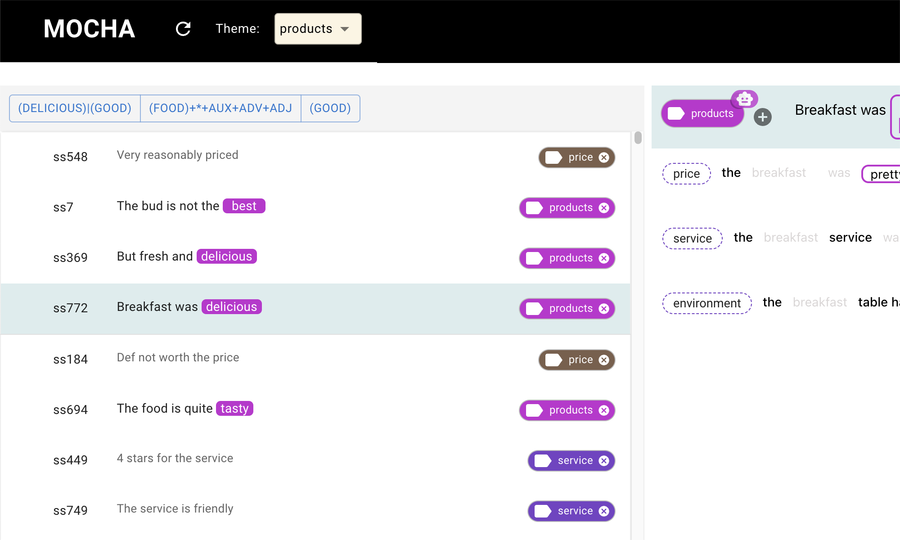








Yukun Yang is an undergraduate student in the Software Engineering program at Tongji University, specializing in human-computer interaction. He is dedicated to leveraging AI technologies to enhance daily life and improve human well-being. Yukun has gained valuable research experience and refined his cross-cultural communication skills through collaboration with diverse international teams. Yukun possesses strong language abilities, being proficient in English and having a basic understanding of German. His leadership skills are evident as a core member of the Tongji University water polo team, where he is responsible for recruiting new members and organizing competitions. Additionally, he leads projects in the Tongji Enlightenment Class, guiding peers in exploring AI application scenarios.

📢 He is open to collaborative research opportunities and eager to contribute to innovative projects in the field of human-computer interaction.

<!-- My research interest includes human-computer interaction. I have published more than 100 papers at the top international AI conferences with total <a href='https://scholar.google.com/citations?user=DhtAFkwAAAAJ'>google scholar citations <strong>260000+</strong></a> (You can also use google scholar badge ). -->

# 🔥 News
- *2024.07*: &nbsp;🎉🎉 I joined saNDwich Lab for summer research at the University of Notre Dame.

# 📝 Publications 

[//]: # (

CHI 2025

)

[//]: # (
)

[//]: # ()
[//]: # ([Supporting Co-Adaptive Machine Teaching through Human Concept Learning and Cognitive Theories]&#40;../images/mocha.png&#41;)

[//]: # ()
[//]: # (Simret Araya Gebreegziabher, **Yukun Yang**, Elena L. Glassman, Toby Jia-Jun Li)

[//]: # ()
[//]: # (<!-- [**Project**]&#40;https://scholar.google.com/citations?view_op=view_citation&hl=zh-CN&user=DhtAFkwAAAAJ&citation_for_view=DhtAFkwAAAAJ:ALROH1vI_8AC&#41; <strong></strong> -->)

[//]: # (- Submitted to CHI 25', under review)

[//]: # (
)

[//]: # (
)

[//]: # ()
[//]: # (- [Supporting Co-Adaptive Machine Teaching through Human Concept Learning and Cognitive Theories]&#40;https://arxiv.org/abs/2409.16561&#41;, Simret Araya Gebreegziabher, Yukun Yang, Elena L. Glassman, Toby Jia-Jun Li, **CHI 2025**)

# 🎖 Honors and Awards
- *2022 / 2023* Second-Class Scholarship for Outstanding Students, Tongji University. 

# 📖 Educations
- *2022 – present*, Tongji University – School of Computer Science and Technology. 
  - Bachelor's Degree in Software Engineering

# 💬 Invited Talks
<!-- - *2021.06*, Lorem ipsum dolor sit amet, consectetur adipiscing elit. Vivamus ornare aliquet ipsum, ac tempus justo dapibus sit amet. 
- *2021.03*, Lorem ipsum dolor sit amet, consectetur adipiscing elit. Vivamus ornare aliquet ipsum, ac tempus justo dapibus sit amet.  \| [\[video\]](https://github.com/) -->

# 💻 Internships
<!-- - *2019.05 - 2020.02*, [Lorem](https://github.com/), China. -->

# 🤽‍ Fun

